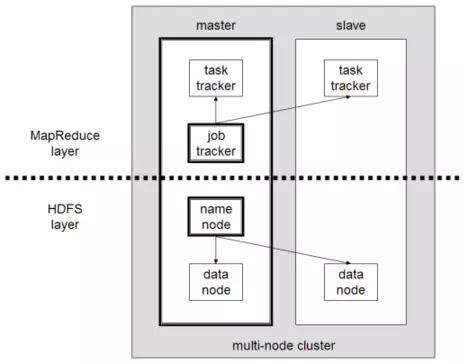
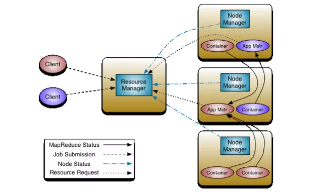

## 1.3 Componentes principales

Cuando se habla de Hadoop se hace referencia a un paquete muy amplio de software a veces también denominado ecosistema Hadoop. Este paquete incluye, junto a los componentes centrales (Core Hadoop), una gran diversidad de extensiones que no solo destacan por sus curiosos nombres (Pig, Chukwa, Oozie o ZooKeeper) sino por ampliar el framework con un gran número de funciones adicionales que sirven para la manipulación de extensos grupos de datos. Todos estos proyectos, estrechamente vinculados entre sí, también son desarrollados bajo el techo de la fundación Apache Software.

El fundamento del ecosistema Hadoop lo constituye el Core Hadoop. Sus componentes en la primera versión son el módulo básico Hadoop Common, el Hadoop Distributed File System (HDFS) y un motor MapReduce. A partir de la versión 2.3 este último fue sustituido por la tecnología de gestión de clústers YARN, también denominada MapReduce 2.0. Esta técnica excluye el algoritmo MapReduce del sistema de gestión en sí, de forma que a partir de este momento se convierte en un plugin basado en YARN.

### Hadoop Common
El módulo Hadoop Common pone a disposición de todos los demás elementos del framework un set de funciones básicas, entre las cuales se encuentran los archivos .jar de Java necesarios para iniciar Hadoop, las bibliotecas para la serialización de datos así como las interfaces para el acceso al sistema de archivos de la arquitectura Hadoop y la llamada a procedimiento remoto (remote procedure call o RPC) para la comunicación entre clientes dentro de un clúster. Además, el módulo también contiene el código fuente, la documentación del proyecto e información sobre otros proyectos de la comunidad Hadoop.

### Hadoop Distributed File System (HDFS)
El sistema de archivos distribuido de Hadoop consiste en un sistema de ficheros de alta disponibilidad para el almacenamiento de un gran volumen de datos en un clúster de ordenadores, encargado del mantenimiento de los datos dentro del framework. Para ello, los archivos se fragmentan en bloques de datos y se distribuyen replicados en varios nodos sin seguir ningún esquema. Según los propios desarrolladores, HDFS es capaz de gestionar cantidades de datos en la escala de los petabytes. Es posible configurar individualmente tanto la longitud de los bloques de datos como el grado de la redundancia.

El clúster de Hadoop funciona básicamente según el principio maestro-esclavo, de tal forma que la arquitectura del framework de software consta de un nodo maestro al cual se subordinan una variedad de nodos esclavos. Este principio también se ve reflejado en la construcción del HDFS, consistente en un namenode (nodo de nombres) y varios datanodes (nodos de datos) subordinados. El nodo de nombres administra todos los metadatos del sistema de archivos, la estructura de ficheros y los archivos. El almacenamiento en sí de los datos se produce en los nodos de datos. Para minimizar la pérdida de datos, los archivos se fragmentan en bloques y se depositan replicados en diferentes nodos. De forma predeterminada, se realizan tres copias de cada bloque.

Cada datanode envía un signo vital al namenode en periodos regulares, el llamado heartbeat (latido). Si no se produce esta señal, el namenode declara a este esclavo como “muerto” y se ocupa, con ayuda de las copias disponibles en otros nodos, de que, a pesar de esta caída, existan en el clúster suficientes copias del bloque en cuestión. El namenode tiene, por esto, una función principal dentro del framework. Para que este no se convierta en el único responsable o “single point of failure”, es habitual nombrarle un “asistente”, el secondary name node, que registra todos los cambios en relación con los metadatos y permite de esta manera una recuperación de la entidad de control central.

El HDFS amplió en el paso de Hadoop 1 a Hadoop 2 con sistemas de seguridad adicionales: namenode HA (High Availability, alta disponibilidad) completa el sistema con una protección automática ante caídas, gracias a la cual se inicia un componente de sustitución en el caso de una caída del namenode. Además, la función Snapshot permite restablecer un estado anterior del sistema. La extensión Federation permite ejecutar varios namenodes dentro de un clúster.

### MapReduce Engine
Otro componente fundamental del Core Hadoop es el algoritmo MapReduce desarrollado por Google, que en la primera versión de Hadoop aún estaba implementado como motor autónomo. La tarea central de esta máquina es la gestión de los recursos así como el control y el seguimiento de los procesos de cálculo (job scheduling/monitoring). El procesamiento de los datos se basa esencialmente en las fases “Map” y “Reduce” y se realiza directamente en el lugar donde se depositan (data locality). Esto acelera el tiempo de cálculo y reduce el tráfico en la red.

En la fase Map los procesos de cálculo se dividen en porciones que se denominan jobs (tareas) y que un jobtracker (rastreador de trabajos) en el nodo maestro distribuye en varios sistemas-esclavo dentro del clúster. Los denominados tasktracker (rastreadores de tareas) se encargan de que estas tareas o procesos trabajen en paralelo. En la consiguiente fase Reduce el motor recoge los resultados parciales y elabora un resultado global.

Mientras que el nodo maestro alberga por lo general los componentes namenode y jobtracker, en cada esclavo trabaja un datanode y un tasktracker. La siguiente imagen muestra una arquitectura Hadoop básica tal como funciona en la primera versión del framework, dividida en una capa MapReduce y una capa HDFS.

El lanzamiento de la version 2.3 de Hadoop significó la reelaboración completa del motor MapReduce, que dio como resultado la tecnología de administración de clústeres YARN/MapReduce 2.0, que separa la gestión de recursos y la administración de tareas (job scheduling / monitoring) propia de MapReduce, abriendo el framework a nuevos modelos de procesamiento y a una amplia paleta de aplicaciones para big data.

### YARN/MapReduce 2.0
La llegada del módulo YARN ("Yet Another Resource Negotiator") en la versión 2.3 cambia fundamentalmente la arquitectura de Hadoop, razón por la cual suele hablarse de una transición de Hadoop 1 a Hadoop 2. Mientras que Hadoop 1 ofrece MapReduce a sus usuarios solo como aplicación, el desacople de la gestión de recursos y la gestión de tareas del modelo de procesamiento de datos permite integrar una gran variedad de aplicaciones para big data en el framework. Como consecuencia, con Hadoop 2 MapReduce se convierte una más entre otras aplicaciones que se pueden usar para acceder a los datos ejecutables en el framework. De esta forma, ya no es posible definir a Hadoop exclusivamente como un entorno de ejecución para MapReduce. En su lugar, YARN toma el papel de un sistema operativo distribuido para la gestión de recursos para aplicaciones para  big data.

Las modificaciones fundamentales de la arquitectura Hadoop afectan sobre todo a los dos rastreadores del motor MapReduce, que en Hadoop 2 ya no existen como componentes independientes. El módulo YARN apuesta, en su lugar, por tres entidades nuevas: el resourcemanager o gestor de recursos, el nodemanager o gestor de nodos y el applicationmaster o maestro de aplicaciones.

Resourcemanager: El gestor global de recursos actúa como la más alta autoridad (maestro) en la arquitectura Hadoop, bajo el cual se alinean diversos nodemanager (esclavos). Tiene la misión de administrar el clúster, orquestar el reparto de los recursos en los nodemanager subordinados y distribuir las aplicaciones. El gestor de recursos sabe en todo momento dónde se encuentran los distintos sistemas esclavo en el clúster y qué recursos se les pueden poner a disposición. Un componente importante del gestor de recursos es el resourcescheduler, que decide cómo se distribuyen los recursos disponibles en el clúster.
Nodemanager: en cada nodo del clúster trabaja un denominado nodemanager que actúa en la posición de esclavo en la infraestructura de Hadoop 2 recibiendo las órdenes del resourcemanager. Cuando en un nodo se inicia un gestor de nodos, este informa al gestor de recursos y le envía un heartbeat periódico. Cada nodemanager es responsable de los recursos de su nodo y pone una parte de ellos a disposición del clúster. El resourcescheduler del gestor de recursos indica la forma como se han de usar los recursos en el clúster.
Applicationmaster: en un sistema YARN, cada nodo contiene un applicationmaster que solicita recursos del resourcemanager y del nodemanager y los recibe en forma de contenedores. El maestro de aplicaciones ejecuta y controla las aplicaciones para big data que estos contienen.
Esta imagen muestra una representación esquemática de la arquitectura Hadoop 2:

Cuando se ha de ejecutar una aplicación en Hadoop 2 participan fundamentalmente tres actores:

Un cliente,
el resource manager y
uno o varios node manager
En un primer paso, el cliente ordena al gestor de recursos iniciar una aplicación en el clúster, el cual reserva en consecuencia un contenedor -reserva recursos del clúster para la aplicación- y contacta a un node manager para que inicie el contenedor y ejecute en él un application master, responsable, a su vez, de ejecutar y supervisar la aplicación.

