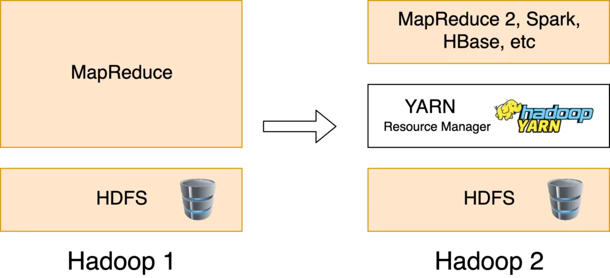

## 1.4 Componentes principales

Para comprender completamente cómo funciona Hadoop debemos entender sus tres componentes principales. Hemos dedicado una entrada a cada uno de ellos:

- MapReduce
- Yarn (Yet Another Resource Negotiator)
- HDFS (Hadoop Distributed File System)

Además de estos componentes, el módulo Hadoop Common aporta las utilidades y librerías comunes del proyecto que soportan el resto de componentes y permiten desarrollar las aplicaciones.

HDFS (Hadoop Distributed File System) es el componente principal del ecosistema Hadoop. Esta pieza hace posible almacenar data sets masivos con tipos de datos estructurados, semi-estructurados y no estructurados. Proporciona la división de los datos en bloques que necesita MapReduce para ejecutar sus fases map y reduce. Está optimizado para almacenar grandes cantidades de datos y mantener varias copias en el clúster para garantizar una alta disponibilidad y tolerancia a fallos.

Por último, Yarn (Yet Another Resource Negotiator) es una pieza fundamental en el ecosistema Hadoop. Es el framework que permite soportar varios motores de ejecución incluyendo MapReduce, y que proporciona un planificador agnóstico a los trabajos que se encuentran en ejecución en el clúster. También se encarga de proporcionar los recursos computacionales necesarios para los trabajos como memoria o cpu.

Alrededor del framework de Hadoop, compuesto por las tres piezas fundamentales: MapReduce, HDFS y Yarn, han surgido todo un conjunto de tecnologías que la complementan y cumplen funciones específicas. Por ejemplo existen tecnologías que facilitan la ingesta de datos hacia el clúster de Hadoop, otras que aceleran el procesamiento o bien facilitan la búsqueda de datos.

En cuanto a las distribuciones de Hadoop, la distribución más extendida y usada en la actualidad es Cloudera. Tras la fusión con Hortonworks se ha convertido en líder de mercado. Se ha encargado de agrupar e integran gran cantidad de estas tecnologías para poder realizar los despliegues de lagos de datos de una manera sencilla y acorde a las necesidades.

