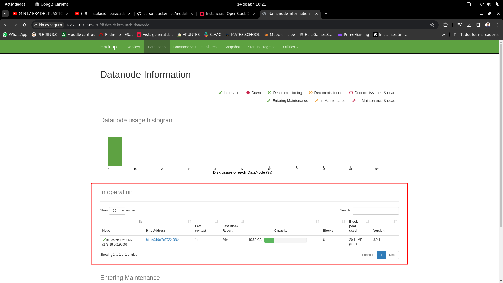
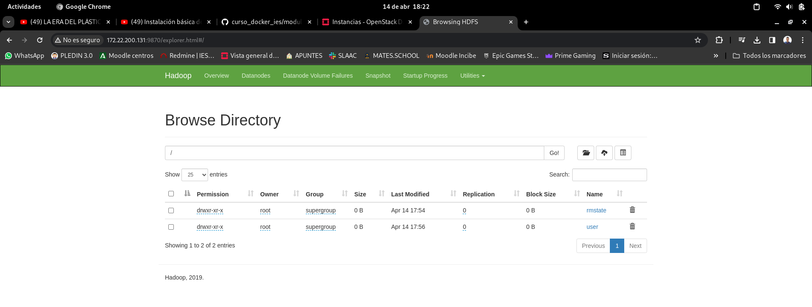

### 2.3 Acceso a la interfaz web de namenode

Una vez este nuestro cluster operativo podremos acceder a la interfaz web de nuestro namenode el cual nos ofrecera informacion general sobre los nodos que tenemos activos , para acceder a este pondremos la IP seguida del PUERTO .

Como estamos utilizando contenedores docker deberemos saber la IP de la maquina donde se estan ejecutando los contenedores , en mi caso es la 172.22.200.131 . A continuacion miraremos haciendo un docker ps a que puerto tendremos que acceder :

```bash
debian@cruces-k8s-1:~/docker-hadoop$ docker ps
CONTAINER ID   IMAGE                                                    COMMAND                  CREATED             STATUS                    PORTS                                                                                  NAMES
978208a4bb44   bde2020/hadoop-resourcemanager:2.0.0-hadoop3.2.1-java8   "/entrypoint.sh /run…"   2 hours ago         Up 2 hours (healthy)   0.0.0.0:8088->8088/tcp, :::8088->8088/tcp                                              resourcemanager
1886eb9c334b   bde2020/hadoop-namenode:2.0.0-hadoop3.2.1-java8          "/entrypoint.sh /run…"   2 hours ago         Up 2 hours (healthy)      0.0.0.0:9000->9000/tcp, :::9000->9000/tcp, 0.0.0.0:9870->9870/tcp, :::9870->9870/tcp   namenode
21256d355687   bde2020/hadoop-nodemanager:2.0.0-hadoop3.2.1-java8       "/entrypoint.sh /run…"   2 hours ago         Up 2 hours (healthy)      8042/tcp                                                                               nodemanager
319cf2cff022   bde2020/hadoop-datanode:2.0.0-hadoop3.2.1-java8          "/entrypoint.sh /run…"   2 hours ago         Up 2 hours (healthy)      9864/tcp                                                                               datanode
054ef200e9a5   bde2020/hadoop-historyserver:2.0.0-hadoop3.2.1-java8     "/entrypoint.sh /run…"   2 hours ago         Up 2 hours (healthy)      8188/tcp                                                                               historyserver

```

En este caso accederemos al puerto 9870.

Una vez accedamos desde el navegador podremos ver información referente a nuestros nodos como el numero de nodos de datos de los mismos :



Entre otras cosas podremos listar los directorios dfs que hay en nuestro cluster 



Principalmente esto es lo que nos ofrece esta interfaz gráfica , esta esta pensada para que tengamos un control visual de los nodos de datos.