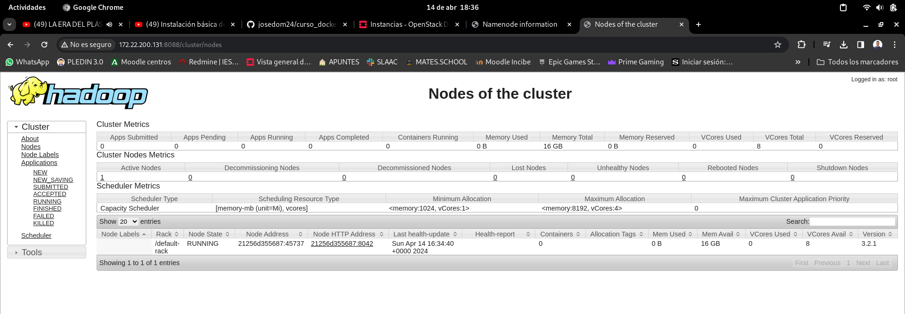
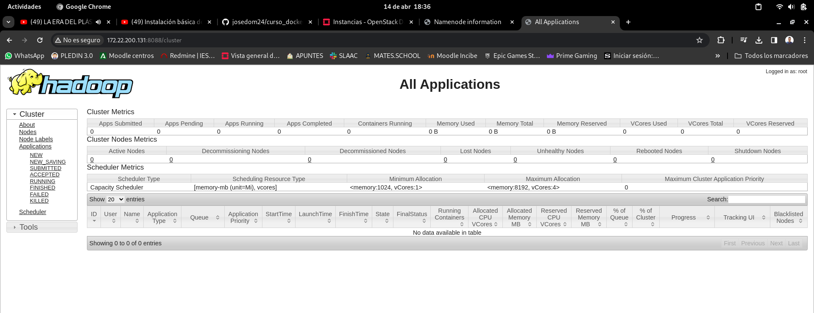

### 2.4 Acceso a la interfaz web de resourcemanager

Una vez este nuestro cluster operativo podremos acceder a la interfaz web de nuestro resourcemanager el cual nos ofrecerá información general sobre los nodos que tenemos activos , para acceder a este pondremos la IP seguida del PUERTO .

Como estamos utilizando contenedores docker deberemos saber la IP de la maquina donde se están ejecutando los contenedores , en mi caso es la 172.22.200.131 . A continuación miraremos haciendo un docker ps a que puerto tendremos que acceder :

```bash
debian@cruces-k8s-1:~/docker-hadoop$ docker ps
CONTAINER ID   IMAGE                                                    COMMAND                  CREATED             STATUS                    PORTS                                                                                  NAMES
978208a4bb44   bde2020/hadoop-resourcemanager:2.0.0-hadoop3.2.1-java8   "/entrypoint.sh /run…"   2 hours ago         Up 2 hours (healthy)   0.0.0.0:8088->8088/tcp, :::8088->8088/tcp                                              resourcemanager
1886eb9c334b   bde2020/hadoop-namenode:2.0.0-hadoop3.2.1-java8          "/entrypoint.sh /run…"   2 hours ago         Up 2 hours (healthy)      0.0.0.0:9000->9000/tcp, :::9000->9000/tcp, 0.0.0.0:9870->9870/tcp, :::9870->9870/tcp   namenode
21256d355687   bde2020/hadoop-nodemanager:2.0.0-hadoop3.2.1-java8       "/entrypoint.sh /run…"   2 hours ago         Up 2 hours (healthy)      8042/tcp                                                                               nodemanager
319cf2cff022   bde2020/hadoop-datanode:2.0.0-hadoop3.2.1-java8          "/entrypoint.sh /run…"   2 hours ago         Up 2 hours (healthy)      9864/tcp                                                                               datanode
054ef200e9a5   bde2020/hadoop-historyserver:2.0.0-hadoop3.2.1-java8     "/entrypoint.sh /run…"   2 hours ago         Up 2 hours (healthy)      8188/tcp                                                                               historyserver
```

En este caso accederemos al puerto 8088.

En la primera ventana podremos ver información general sobre los nodos de hadoop:



Ademas podremos ver estadísticas de las diferentes aplicaciones ejecutadas :



Como ves la interfaz es meramente informativa y nos permite llevar un seguimiento de lo que esta sucediendo en nuestros nodos , posteriormente cuando ejecutemos trabajos veremos como nos indica el estado de los mismos .